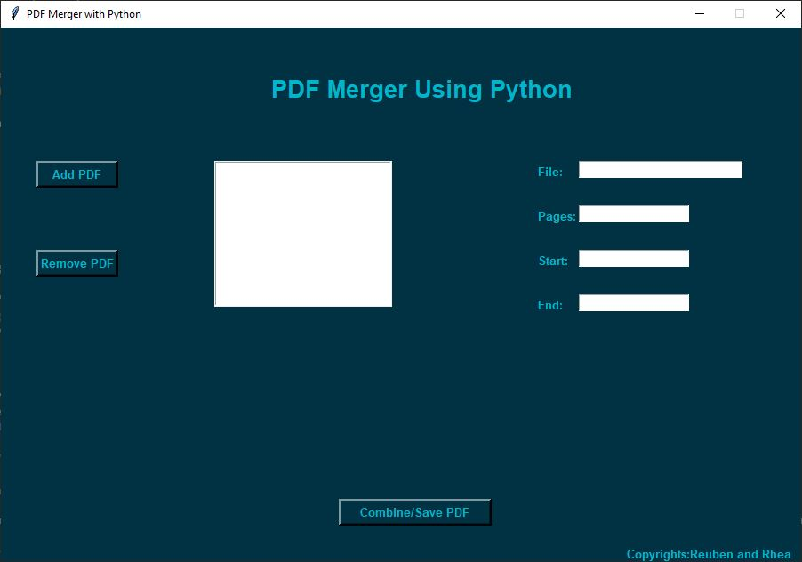
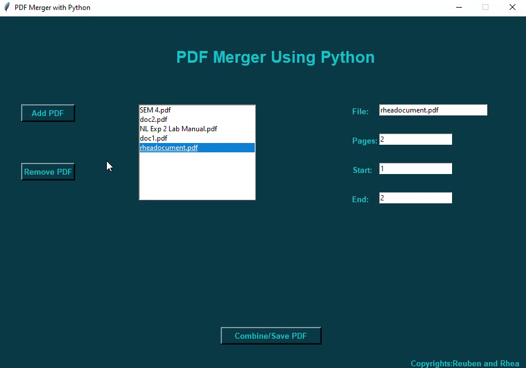

# PDF-Merger-Using-Python-3

<h2 style="background-color:#ffcc00;">A PDF merger application which can merge multiple pdfs.</button>
</h2>
<h2>The PDF Merger Screen: </h2>

<h2> Adding A PDF It is Displayed in the ListBox: </h2>

<h2>Editing Page Numbers to be Combined: </h2>

 

<h2>Removing A PDF From the Listbox: </h2>

 

<h2>Slide and Dropping in the Order You Need: </h2>

 

<h2>To Save A PDF: </h2>

 

